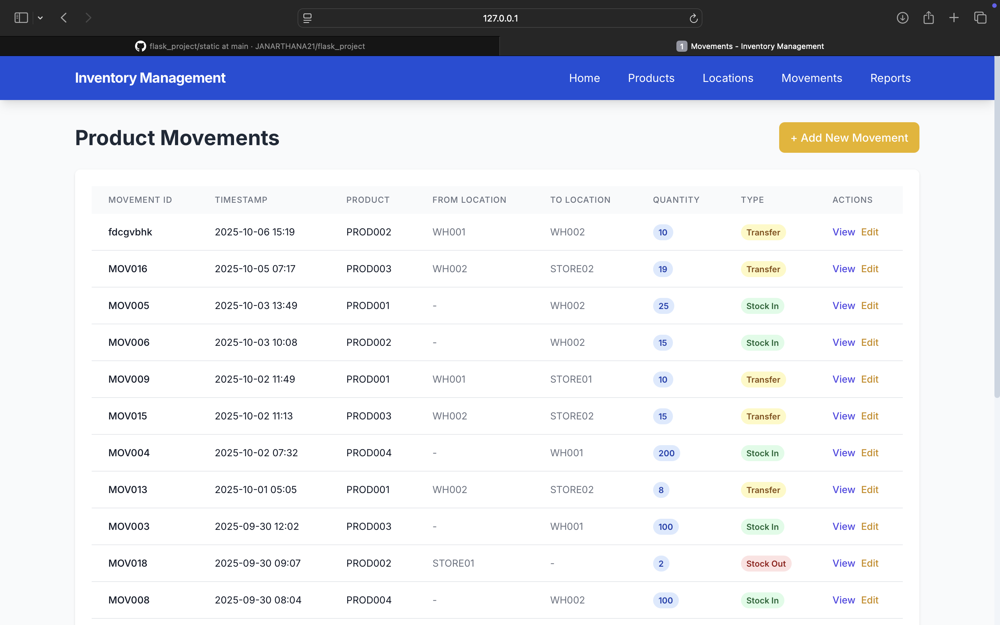

# Flask Inventory Management System

## What This App Does

- **Manage Products**: Keep track of all your products with unique IDs
- **Manage Locations**: Organize warehouses and stores  
- **Track Movements**: See when products move between locations
- **Check Stock**: Know exactly how much inventory you have where
- **Generate Reports**: Get detailed reports on your inventory


## Quick Start Guide (For Beginners)

### Step 1: Get Python Ready
Make sure you have Python installed on your computer. You can download it from [python.org](https://python.org) if you don't have it.

### Step 2: Open Your Terminal/Command Prompt
- **Mac**: Press `Cmd + Space`, type "Terminal", press Enter
- **Windows**: Press `Win + R`, type "cmd", press Enter
- **Linux**: Press `Ctrl + Alt + T`

### Step 3: Navigate to Your Project
```bash
cd Desktop/flask
```

### Step 4: Install What You Need
```bash
pip3 install flask flask-sqlalchemy
```
*Note: On Mac/Linux, use `pip3` and `python3`. On Windows, use `pip` and `python`.*

### Step 5: Set Up Sample Data
Run this to create example products, locations, and movements:
```bash
python3 seed_data.py
```

### Step 6: Start Your App
```bash
python3 app.py
```

### Step 7: See Your App in Action! 
Open your web browser and go to: **http://127.0.0.1:5002**

````
flask-inventory/
├── app.py                 # Main Flask app (this is where everything starts!)
├── seed_data.py          # Creates example data for you to try
├── requirements.txt      # List of what Python needs to install
├── README.md            # This guide you're reading!
├── static/
│   └── style.css        # Makes everything look pretty (Tailwind CSS)
├── views/               # All the web pages (HTML files)
│   ├── base.html        # Base template (shared layout)
│   ├── index.html       # Main dashboard page
│   ├── products/        # Product-related pages
│   │   ├── index.html   # List all products
│   │   ├── add.html     # Add new product
│   │   └── edit.html    # Edit existing product
│   ├── locations/       # Location-related pages
│   │   ├── index.html   # List all locations  
│   │   ├── add.html     # Add new location
│   │   └── edit.html    # Edit existing location
│   ├── movements/       # Movement tracking pages
│   │   ├── index.html   # List all movements
│   │   └── add.html     # Record new movement
│   └── reports/         # Reports and analytics
│       └── stock_balance.html  # Stock balance report
└── inventory.db         # SQLite database (created automatically)
```

## Screenshots

### HOME


### PRODUCTS  


### LOCATIONS


### MOVEMENTS


### REPORTS

